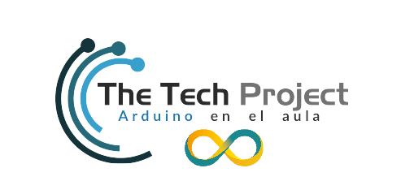

# The Tech Project: Arduino en el aula
Recursos para el curso de formación sobre el uso de Arduino en Educación Secundaria

# Licencia:
Los contenidos han sido desarrollados por:
- Jose Pujol
- Jose Antonio Vacas

Todos los recursos están disponibles bajo licencia Creative Commons 4.0 [Creative Commons Attribution-ShareAlike 4.0 International License](http://creativecommons.org/licenses/by-sa/4.0/)

Dirección y realización del curso:
Avante S.L http://www.avante.es/

